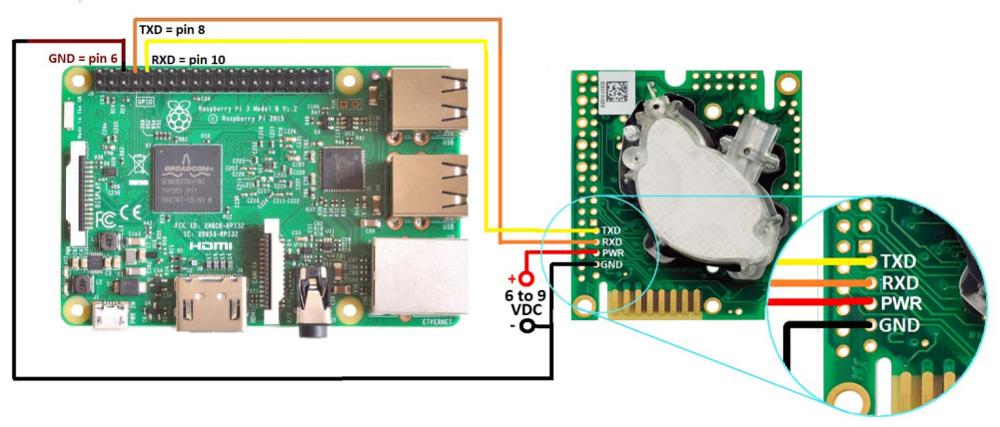
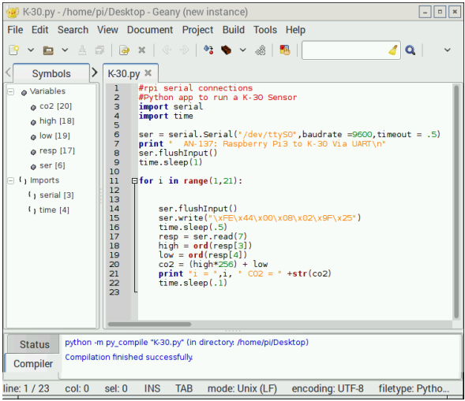

# Setting Up The RaspberryPi (RPI) Project

## Set up your RPI3

1. You will nee3d to set up your RPI3 with Raspian 8. For more details, follow this link: https://www.raspberrypi.org/help/faqs/#generalNoobs

2. Connect your Raspberry Pi to your keyboard, mouse, monitor and 5VDC power supply.

3. Power the RPi3 and LCD monitor. In order to access to the attached python files,you will need an internet connection. RPi3 offers a built‐in Wi‐Fi device. On your monitor, find the icon of a terminal. Select the icon, select your Wi‐Fi network, and enter your network password.

4. Verify that you are connected via Wi‐Fi. On your monitor, select the globe icon to open an internet browser. Verify your internet connection by going to https://google.com.

5. Search for AN‐237 in the App Notes tab at http://www.co2meter.com. Download the zip file to your Raspian downloads directory. Unzip this directory to access the python files.

## Wire up your device as shown:

## Create and run your RPI3-K30 Project
   1. Select Menu -> Programming -> Geany

   2. Select File -> Open -> pi -> AN137 -> K30

   3. Verify that you see:
   

   4. Select Build -> compile

   5. Select Build -> execute
