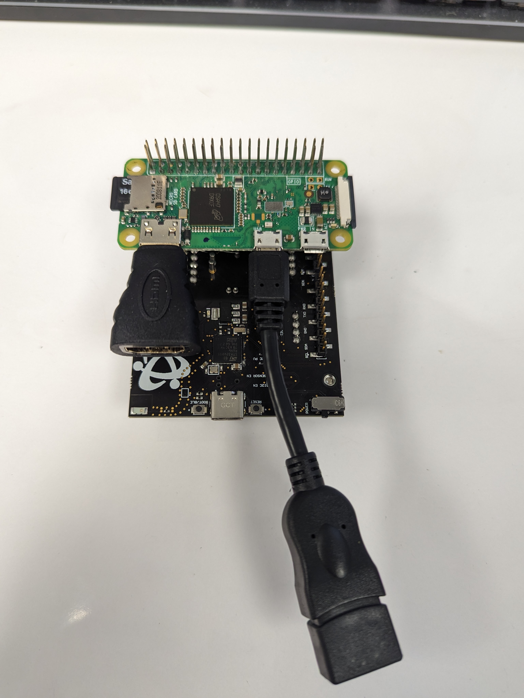
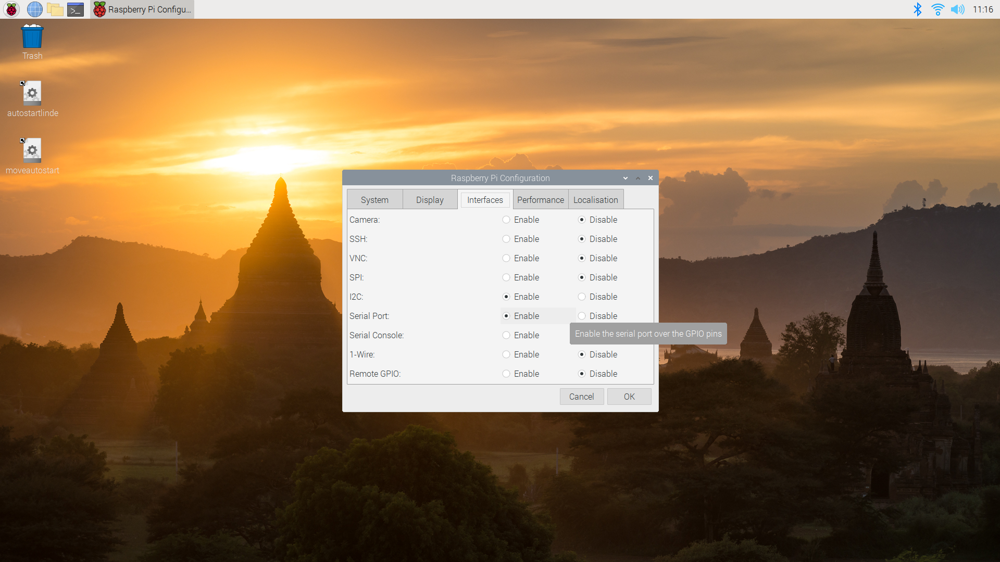
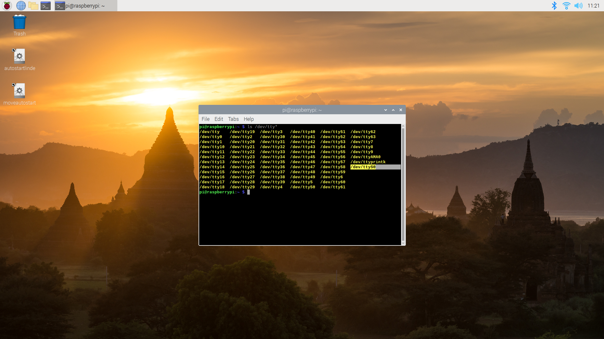
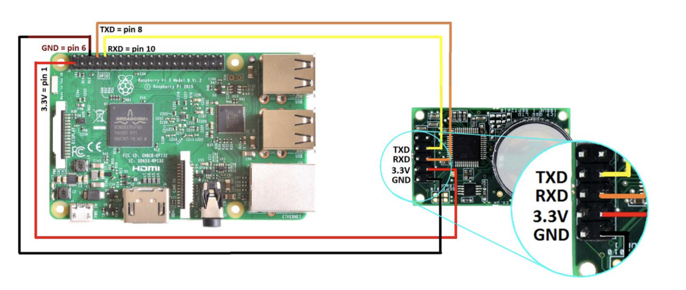

# Setting Up The RaspberryPi (RPI) Project

## Set up your RPI3

1. You will nee3d to set up your Raspberry Pi with Raspian. For more details, follow this link: [https://www.raspberrypi.com/software/](https://www.raspberrypi.com/software/)

2. Connect your Raspberry Pi to your keyboard, mouse, monitor and 5VDC power supply.

3. Power the RPi3 and LCD monitor. In order to access to the attached python files,you will need an internet connection. RPi3 offers a built‐in Wi‐Fi device. On your monitor, find the icon of a terminal. Select the icon, select your Wi‐Fi network, and enter your network password.

4. Verify that you are connected via Wi‐Fi. On your monitor, select the globe icon to open an internet browser. Verify your internet connection by going to https://google.com.

5. Download or clone the repository to the home folder, and navigate to the folder.  You can find instructions on the [ExampleCode main README](https://github.com/co2meter-org/ExampleCode).


## CM-200 Setup
### Switch Settings
Leave the Sensor Configuartion Jumpers as default.  Switch the I2C / UART Switch to the right over UART, and the USB - BLE / ARD - RPI Switch to the right over ARD - RPI.  As pictured below.


### Raspberry Pi
CO2Meter recommends, for Raspberry Pi Zero, purchasing and soldering these [header pins](https://www.amazon.com/gp/product/B084Q4W1PW/ref=ox_sc_act_title_1?smid=A12R7FMO56ISX4&psc=1) to be able to stack on top of the CM-200


Additionally, with a Raspberry Pi SBC, CO2Meter recommends a ribbon cable and / or breakout board such as [this](https://www.amazon.com/gp/product/B08D3S6FGH/ref=ppx_yo_dt_b_asin_title_o02_s00?ie=UTF8&psc=1)

Ensure that the Serial Port is available.  To enable the Serial Port, go to the Raspberry Pi menu at the top left of the Desktop, go to Preferences, then go to Raspberry Pi Configuration.  From the Configuration Settings, go to the Interfaces tab and ensure that the settings are enabled as below:


After a restart, double check that the serial TTYS0 is available by opening a terminal and typing:
```
ls /dev/tty*
```

and ttyS0 should appear as below:


## Wiring without a CM-200



## Create and run your RPI3-K30 Project
   1. Download or clone the repository

   2. Navigate to the python script home -> pi -> ExampleCode -> GSS -> GSS Raspberry Pi

   3. Double Click on sst.py

   4. Thonny should open with the sst.py code displayed

   5. Click the Run button
