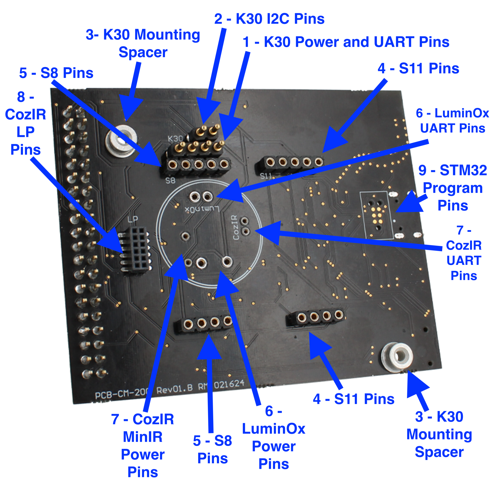

# CO2Meter Example Code

### Table of Contents
- [CM-200 Sensor Development Board](#cm-200-sensor-development-board)
- [CM-200 Compatible Sensors](#compatible-sensors)
- [Getting to know your CM-200 Sensor Development Kit](#getting-to-know-your-cm-200-sensor-development-kit)

# CM-200 Sensor Development Board
The CM-200 Sensor Development Board is a kit developed by CO2Meter to help customers, hackers, and students to go from concept to product as quickly as possible.  We've provided a PCB that can interface with our free [GasLab](https://www.co2meter.com/pages/downloads) or any terminal application to evaluate sensors and view the communication protocols.  Using the CM-200 as an Arduino Shield and the example code provided in this repository can rapidly get a prototype running for interfacing our most popular sensors with Arduino Uno and Arduino Mega.  Also available, use the CM-200 as a Raspberry Pi Hat to prototype using the Raspberry Pi ecosystem.  Finally, users can also develop production ready code with the onboard STM32WB55, with available BLE, USB, User LEDs, User Buttons, and multiple communication protocols.

## Compatible Sensors
### K-Series CO2 Sensors
- [030-8-0006 K30 10,000ppm CO2 Sensor](https://www.co2meter.com/collections/co2-sensors/products/k-30-co2-sensor-module)
- [030-7-0007 K30 10% CO2 Sensor](https://www.co2meter.com/collections/co2-sensors/products/k-30-co2-sensor)
- [030-8-0011 K30 Extended Range](https://www.co2meter.com/collections/co2-sensors/products/030-8-0011-k30-extended-range)
- [030-8-0016 K30 1% CO2 Sensor](https://www.co2meter.com/collections/co2-sensors/products/030-8-0016-k30-1-co2-sensor)
- [030-8-0010 K30 FR Fast Response 10,000ppm CO2 Sensor](https://www.co2meter.com/collections/sensors/products/k-30-fr-co2-sensor)

### Sunrise CO2 Sensors
- [006-0-0008 Senseair Sunrise HVAC CO2 Sensor](https://www.co2meter.com/collections/sensors/products/senseair-sunrise-co2-sensor)
- [006-0-0007 Senseair Sunrise CO2 Sensor](https://www.co2meter.com/collections/sensors/products/006-0-0007-senseair-sunrise-co2-sensor)
- [009-4-0001 Senseair Sunlight Refrigerant R32 Sensor](https://www.co2meter.com/collections/sensors/products/009-4-0001-senseair-sunlight-refrigerant-r32-sensor?variant=42820894064838)
- 

### Senseair Miniature Sensors
> If marked with a * request no pins.  May need to purchase longer pin headers
- [004-0-0013 S8 Miniature 10,000ppm CO2 Sensor](https://www.co2meter.com/collections/sensors/products/s8-miniature-co2-sensor)
- [004-0-0071 S8 Miniature 5% CO2 Sensor](https://www.co2meter.com/collections/sensors/products/s8-miniature-5-co2-sensor)
- [004-0-0010 Senseair Commercial CO2 Sensor](https://www.co2meter.com/collections/sensors/products/004-0-0010-senseair-s8-commercial-co2-sensor)
- [004-0-0017 S8 Alarm 5% CO2 Sensor](https://www.co2meter.com/collections/sensors/products/004-0-0017-s8-alarm-5-co2-sensor)
- [004-0-0050 Senseair S8 2% CO2 Sensor](https://www.co2meter.com/collections/sensors/products/004-0-0050-senseair-2-percent-co2-sensor)
- [*CM1106H-NS NDIR CO2 Sensor](https://www.co2meter.com/collections/sensors/products/ndir-high-accuracy-co2-sensor)
- [*CM1106SL-N Super Low Power NDIR CO2 Sensor](https://www.co2meter.com/collections/sensors/products/cm-1106sl-n-low-power-ndir-co2-sensor)
- [*CM1107N NDIR Dual Channel CO2 Sensor](https://www.co2meter.com/collections/sensors/products/ndir-dual-beam-co2-sensor-module)
- [*CM1107H 5% CO2 Dual Channel NDIR CO2 Sensor](https://www.co2meter.com/collections/sensors/products/cm1107h-co2-safety-gas-sensor)
- [*CM1109 Dual IR Source NDIR CO2 Sensor](https://www.co2meter.com/collections/sensors/products/cm1109-dual-ir-source-ndir-co2-sensor)

### LuminOx Sensors
- [LOX-O2 UV Flux 25% Oxygen Smart Sensor](https://www.co2meter.com/collections/sensors/products/25-percent-oxygen-sensor)
- [LOX-O2-F UV Flux 25% Oxygen Flow Through Sensor](https://www.co2meter.com/collections/sensors/products/uv-flux-25-oxygen-smart-flow-through-sensor)

### MinIR Sensors
- [SprintIR®-6S 5% CO2 Sensor](https://www.co2meter.com/collections/sensors/products/sprintir6s-5-co2-smart-sensor)
- [SprintIR®-6S 20% CO2 Sensor](https://www.co2meter.com/collections/sensors/products/sprintir6s-20-co2-smart-sensor)
- [SprintIR®-6S 100% CO2 Sensor](https://www.co2meter.com/collections/sensors/products/sprintir6s-100-co2-smart-sensor)
- [SprintIR®-R 5% CO2 Sensor](https://www.co2meter.com/collections/sensors/products/gss-sprintir-r-5-co2-sensor)
- [SPRINTIR®-R 20% CO2 Sensor](https://www.co2meter.com/collections/sensors/products/sprintir-r-20-co2-sensor)
- [SprintIR®-R 100% CO2 Sensor](https://www.co2meter.com/collections/sensors/products/copy-of-sprintir-r-100-co2-sensor)
- [ExplorIR®-M 5% CO2 Sensor](https://www.co2meter.com/collections/sensors/products/minir-co2-sensor)
- [ExplorIR®-M 20% CO2 Sensor](https://www.co2meter.com/collections/sensors/products/explorir-20-co2-smart-led-sensor)
- [ExplorIR®-M 100% CO2 Sensor](https://www.co2meter.com/collections/sensors/products/explorir-100-pct-co2-sensor)

### LP Sensors
- [CozIR®-LP Miniature 5,000ppm NDIR CO2 Sensor](https://www.co2meter.com/collections/sensors/products/cozir-lp-ambient-air-co2-sensor)
- [CozIR®-LP2 5000ppm CO2 Sensor](https://www.co2meter.com/collections/sensors/products/copy-of-cozir-lp-miniature-5-000ppm-co2-sensor)
- [CozIR®-Blink Sensor](https://www.co2meter.com/collections/sensors/products/gss-co2meter-cozir-blink-co2-sensor)

## Getting to know your CM-200 Sensor Development Kit
### Connector Side

> The top of the CM-200 will have the electonics running the development kit, including the microcontroller and headers for Arduino and Raspberry Pi.

#### 1. Arduino Shield Headers
To attach an Arduino Uno or Arduino Mega, set the CM-200 onto the headers of the Arduino.  The Arduino can power the CM-200, or the Arduino can be powered by the USB Type-C connector.  To run the example code for a specific sensor, download or clone this repository, download and install [Arduino IDE](https://www.arduino.cc/en/software), navigate to the sensor Arduino code, double click the .ino file and click Upload.

#### 2. Raspberry Pi Hat Headers
Soldering a female socket to a Raspberry Pi Zero will fit directly onto the CM-200.  If using a full Raspberry Pi Single Board Computer, such as a Raspberry Pi 4, a direct connection can be done with a cable assembly such as [this](https://www.digikey.com/en/products/detail/adafruit-industries-llc/1988/7241480?s=N4IgTCBcDaIIwFYwA4C0YwGYGoHIBEQBdAXyA).  The Raspberry Pi can power the CM-200, or the Raspberry Pi can be powered by the USB Type C connector on the CM-200.  To run the example code, download or clone this repository onto the Raspberry Pi, navigate to the sensor Raspberry Pi python code, and double click.

#### 3. USB Type-C Connector
USB Type-C connector will provide 5V to the board while also appear on a PC as virtual COM port for communication through any terminal application such as [RealTerm](https://sourceforge.net/projects/realterm/) or [CoolTerm](https://freeware.the-meiers.org/).  You can also download our Free [GasLab](https://www.co2meter.com/pages/downloads) software for Windows to evaluate, configure, and calibrate, as well as read the communication between Host and Sensor to help with development of communications with the sensors.

#### 4. Power Switch
Turn on and off the CM-200 and any other devices powered by the CM-200.

#### 5. 3v3 LDO and Power Indicator
Provides a 3.3V local power supply for the CM-200 to power the microcontroller.  Also has an LED indicator to show that power is on.

#### 6. STM32WB55
Microcontroller running the CM-200 for USB V-COM and BLE communication.  Programmable for more production ready code.  There is a starting point for the USB V-COM already available in this Git Repository.

#### 7. Reset Button
To reset the STM32WB55 (V-COM port)

#### 8. BLE Enable Button (Provisional)
By default, the CM-200 is not advertising over BLE for connection.  To make a BLE connection, press and hold the BLE Enable Button until the Blue User LED lights up.  The Green User LED will light up when a connection is made.

Also can be used and programmable when developing code for the STM32WB

#### 9. User LEDs
User controllable LEDs from Arduino or Raspberry Pi.  Also used as indicators for BLE in default mode.

#### 10. User Button
User programmable button that is controllable from Arduino or Raspberry Pi.

#### 11. I2C or UART Switch
Certain sensors share pins with UART and I2C busses.  To communicate with those sensors over UART, move the switch to the right.  To communicate with those sensors over I2C, move the switch to the left.

#### 12. Switch for UART Source
UART can only be used from a single source.  To use UART with STM32WB over Bluetooth or USB, slide the switch to the left over USB BLE.  If doing any development with Arduino or Raspberry Pi, slide the switch to the right over ARD RPI.

#### 13. Sensor Configuration Jumpers
Some sensors have pin configurations to switch between I2C and UART, or to hold the Sensor in Enabled mode or be user controlled.  Those can be changed by making cuts or solder bridges on the pads.  There are also by default I2C Pull Up resistors, whic if using external I2C development kits that already have I2C Pull Ups, then a cut can be made to remove the Pull Ups.

### Sensor Side

> The bottom of the CM-200 has sockets and pogo pins for the sensors, mounting hardware, and programming pins for the STM32WB

#### 1. K30 Power and UART Pins
Pogo pins to provide 5V as well as RX and TX for UART Communication to a [Sensair K30 (030-8-0006)](https://www.co2meter.com/collections/sensors/products/k-30-co2-sensor-module).  WHen sensor is aligned and mounted to the [mounting spacers](#3-k30-mounting-spacers), all of the pogo pins wills make necessary contact with the K30.

#### 2. K30 I2C Pins
Pogo pins for I2C Communication with a [Sensair K30 (030-8-0006)](https://www.co2meter.com/collections/sensors/products/k-30-co2-sensor-module).  No power is provided.  There are 4.7k pull up resistors available by default that can be removed by cutting the pads on the [sensor configuration jumpers](#13-sensor-configuration-jumpers).

#### 3. K30 Mounting Spacers
Mounting spacers for the [Sensair K30 (030-8-0006)](https://www.co2meter.com/collections/sensors/products/k-30-co2-sensor-module).  Use M2.5 screws on both sides of the sensor and ensure good contact is made to the pogo pins.  Do not overtighten!

#### 4. S11 Pins
Pin sockets for [Senseair Sunrise 006-0-0008](https://www.co2meter.com/collections/sensors/products/senseair-sunrise-co2-sensor) formerly known as SE-11 or SE-12.  Use included Press-Fit male header pins to mount the sensor to the sockets.

#### 5. S8 Pins
Pin sockets for [Senseair S8 004-0-0013](https://www.co2meter.com/collections/sensors/products/s8-miniature-co2-sensor).  Use included Press-Fit male header pins to mount the sensor to the sockets.

#### 6. LuminOx Pins
Pin sockets for inserting an [SST LOX-O2 UV Flux](https://www.co2meter.com/collections/oxygen-sensors/products/25-percent-oxygen-sensor).  

#### 7. CozIR MinIR Pins
Pin sockets for inserting a [GSS MinIR or SprintIR CO2 Sensor](https://www.co2meter.com/collections/100-percent-co2-sensors/products/explorir-100-pct-co2-sensor).

#### 8. CozIR LP Pins
Pin sockets for inserting a [GSS LP or LP2 Sensor](https://www.co2meter.com/collections/1-percent-co2-sensor/products/copy-of-cozir-lp-miniature-5-000ppm-co2-sensor).

#### 9. STM32 Programming Pins
Designed for use with [TC2030-CTX-NL-STDC14](https://www.tag-connect.com/product/tc2030-ctx-nl-stdc14-for-use-with-stm32-processors-with-stlink-v3) and [STLINK-V3MINIE](https://www.digikey.com/en/products/detail/stmicroelectronics/STLINK-V3MINIE/16284301?s=N4IgTCBcDaIMoBUAyBJAcgaQLQDUDMAsuigKIgC6AvkA).

