# SE-11 Senseair Sunrise

## Table of Contents
- [CM-200 Sensor Development Kit](#cm-200-sensor-development-kit)
- [S11 Development Kit (Retired)](#s11-development-kit)


# CM-200 Sensor Development Kit

## Materials Needed
- CM-200 Gas Sensor Development Kit
- Senseair Sunrise Sensor
- USB Type-C Cable
- Included 5-pin and 4-pin Press-Fit Headers

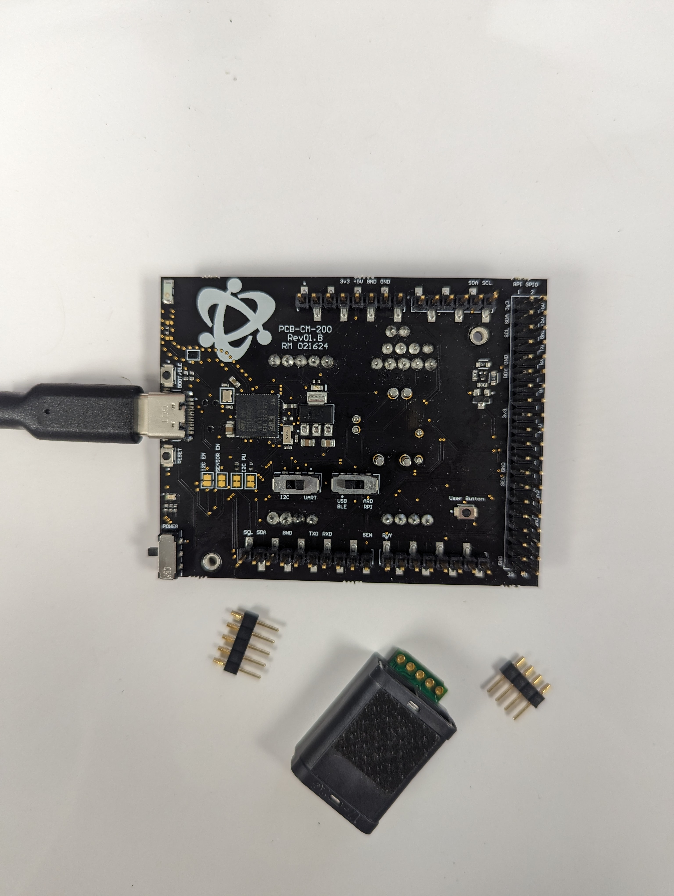

Use a fair amount of force to push the press-fit headers into the Sensor, then set them into their corresponding sockets.  It should look like the below image
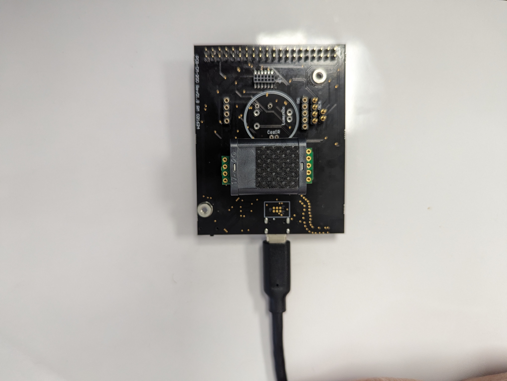

## CM-200 Setup for GasLab with Senseair Sunrise
> Setup Instructions to use Senseair Sunrise with GasLab or other terminal application through USB

### Switch Settings
Leave the Sensor Configuration Jumpers as default.  Switch the I2C / UART Switch to the right over UART, and the USB - BLE / ARD - RPI switch to the left over USB - BLE.  As pictured below.
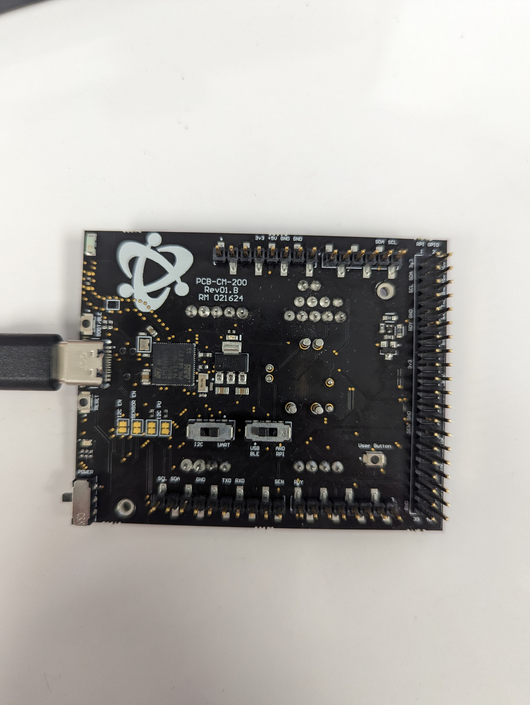

### Connect to GasLab
#### 1. Plug in the USB cable
#### 2. Move the Power Switch Up so that it's towards the USB connector, a Red LED should emit
#### 3. Launch GasLab
#### 4. Select COM Port and Sensor
#### 5. Click Connect

## CM-200 Setup for Arduino and Raspberry Pi with UART
> Setup instructions to use Senseair Sunrise with an Arduino or Raspberry Pi over UART

### Switch Settings
Leave the Sensor Configuartion Jumpers as default.  Switch the I2C / UART Switch to the right over UART, and the USB - BLE / ARD - RPI Switch to the right over ARD - RPI.  As pictured below.


### Arduino Setup
#### 1. If not already installed, download and install [Arduino IDE](https://www.arduino.cc/en/software)
#### 1. Mount the CM-200 onto the Header Pins of an Arduino Uno or Arduino Mega
#### 2. Power Arduino or CM-200 with USB cable
#### 3. Download or Clone Repository
#### 4. Naviagate to Arduino Project to run
#### 5. Double click .ino file
#### 6. Click on the Upload button in Arduino

### Raspberry Pi Setup
#### 1. Mount the CM-200 onto the header pins of a Raspberry Pi Zero, or connect ribbon cable to Raspberry Pi SBC
#### 2. Download or Clone Repository onto Raspberry Pi
#### 3. Navigate to python code to run
#### 4. Run python code

## CM-200 Setup for Arduino with I2C
> Setup instructions to use Senseair Sunrise with an Arduino over I2C
>
> ### Switch Settings
Add a solder bridge over the I2C EN jumper.  Switch the I2C / UART Switch to the left over I2C, switch the USB - BLE / ARD - RPI switch to the right over ARD - RPI.  As pictured below.
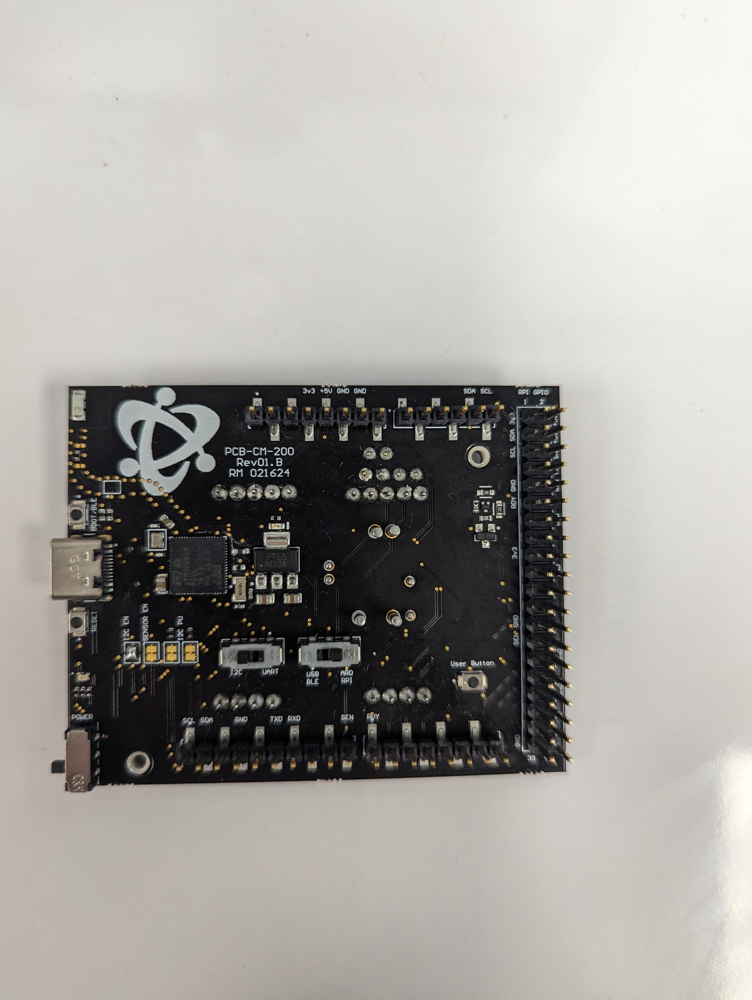

# S11 Development Kit

  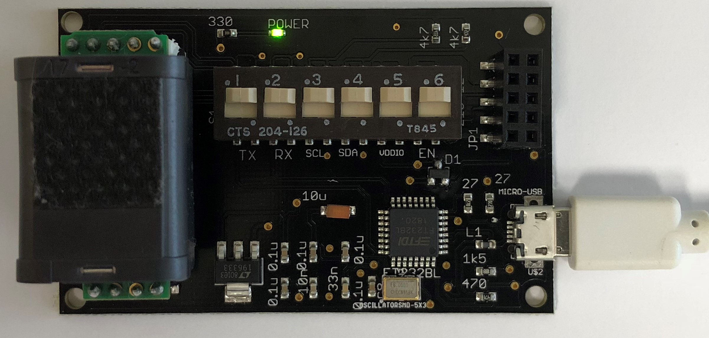

## Section 1: Learning About Your Development Kit

- ### 1.1 Connectors
There are four main connectors on the S11 Development Kit, each serving a different function.
  - 1.1.1 Sensor Connectors
  > 4-pin and 5-pin connectors to mount your S11 Sensor

  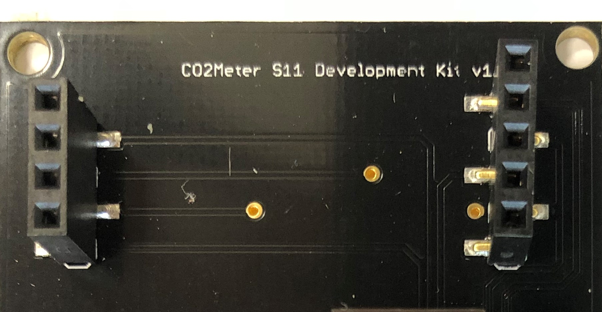

  - 4-pin Connector
    1. Enable - Sensor Enable
    2. DVCC - Digital Voltage Out
    3. nRDY - Sensor Ready
    4. COMSEL - UART/I<sup>2</sup>C Comm Select

  - 5-pin Connector
    1. Ground
    2. V<sub>BB</sub> - Sensor Voltage Input
    3. V<sub>DDIO</sub> - Digital Input/Output Reference Voltage
    4. R<sub>x</sub>D/SDA - Sensor UART Receiver and Sensor I<sup>2</sup>C Data
    5. T<sub>x</sub>D/SCL - Sensor UART Transmitter and Sensor I<sup>2</sup>C Clock


  - 1.1.2 USB Connector
    >The Micro USB Connector allows you to connect your Development Kit to your PC and appears as an FTDI Cable.  You can then use your favorite application(GasLab, TeraTerm, etc.) to communicate with the S11 Sensor via UART.  

    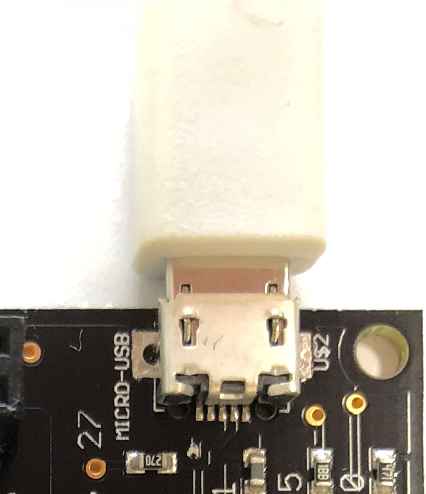

  - 1.1.3 Microcontroller and GasBox Connector
    > 10-pin breakout connector to easily connect your S11 Sensor to the GasBox, Arduino, Raspberry Pi, or other UART / I2C microcontroller.

    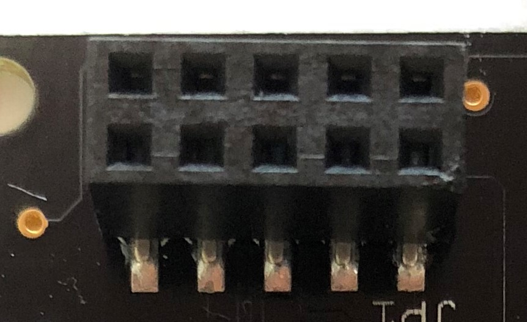

    1. Ground
    2. Enable
    3. S11 Voltage Input
    4. S11 DVCC
    5. S11 VDDIO
    6. S11 nRDY
    7. TX / SDA
    8. COMSEL
    9. RX / SCL

- ### 1.2 Switch Settings
  - 1.2.1 Switch Functions
    * 1: S11 RX Selector - Selects the source of transmit from USB or a microcontroller connected to the 10-pin Connector (Slide Up for USB and Slide Down for Microcontroller)
    * 2: S11 TX Selector - Selects the source of the receiver from USB or a microcontroller connected to the 10-pin Connector (Slide Up for USB and Slide down for Microcontroller)
    * 3: I<sup>2</sup>C SCL Pull Up Resistor - Slide down to add a Pull Up Resistor to your I<sup>2</sup>C Serial Clock attached to the 10-pin Microcontroller Connector.  If using USB connector, leave this switch function Up.
    * 4: I<sup>2</sup>C SDA Pull Up Resistor - Slide down to add a Pull Up Resistor to your I<sup>2</sup>C Serial Data attached to the 10-pin Microcontroller Connector.  If using USB Connector, leave this switch function Up.
    * 5: VDDIO - The S11 Sensor requires a reference voltage for the Communications.  To use the same voltage as what is supplied to power the S11 Sensor, keep the switch function up, to use a different IO Voltage supplied on the 10-pin Connector, push the switch down.  For standard USB Connection, leave this switch function up.
    * 6: Enable - The S11 Sensor has the ability to turn on and off the Sensor element to save power.  To have the Sensor always enabled and taking measurements, slide the switch function up.  If you will have a microcontroller connected to the 10-pin microcontroller connector and enabling and disabling the sensor, slide the switch function down.

  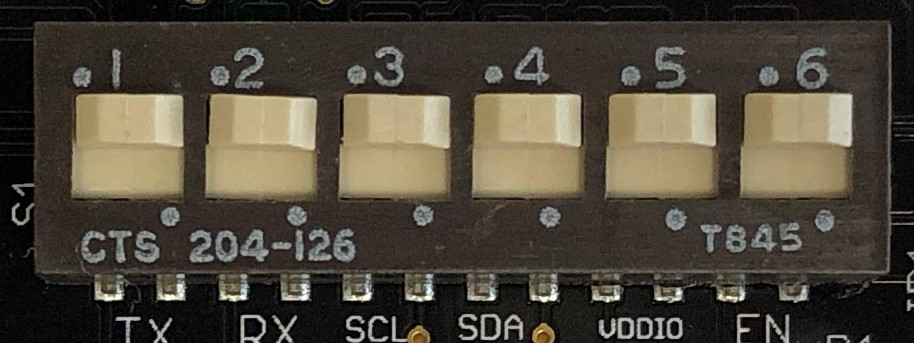

  - 1.2.2 Typical Switch Settings
    - USB
      > To use via USB UART with GasLab or any other terminal application, keep all slide switch functions in the up position

  

    - Simple Microcontroller UART
      > To simply connect to a microcontroller via UART, slide switch functions 1 and 2 down, and leave the rest of the switch functions in the up position

  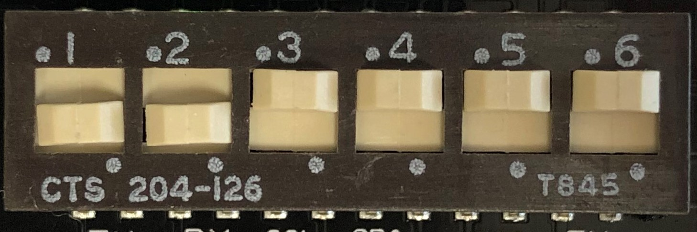

    - Simple Microcontroller I<sup>2</sup>C with no Pull Up Circuit
      > To attach to a microcontroller via I<sup>2</sup>C, we've added the convenience of 4.7kOhm pull up resistors.  This way you can connect your I<sup>2</sup>C wiring directly without a circuit in between.  To use this function, slide switch functions 1, 2, 3, and 4 to the down position, leave switch functions 5 and 6 in the up position

  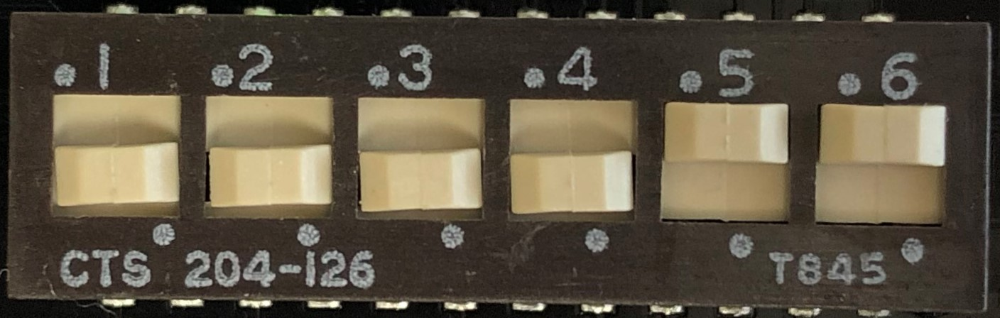

    - Full Microcontroller UART Support
      > To attach a microcontroller that will control the S11 Sensor being integrated into a system, slide switch functions 1, 2, 5, and 6 to the down position, and slide switch functions 3 and 4 to the up position

  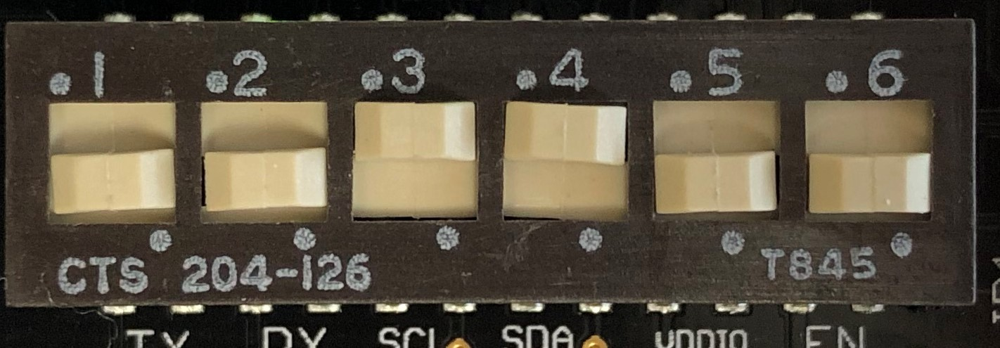


## Section 2: Connecting to GasLab with USB

1. Connect a micro USB Cable from your PC to the Development Kit
> Ensure the Switch Setting are Correct.  Refer to section 1.2.2 for more help

  

2. Open GasLab on your PC, select the COM Port, use FTDI as the Kit, and select Senseair / S-11 for your Series / Model

    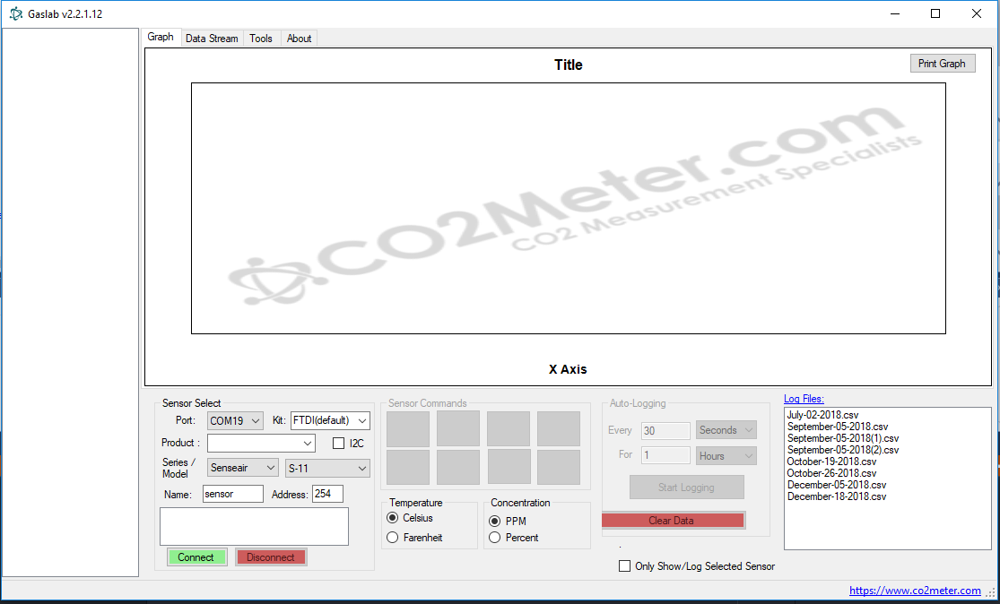

3. Click the Connect Button and click Read CO2 to get readings

    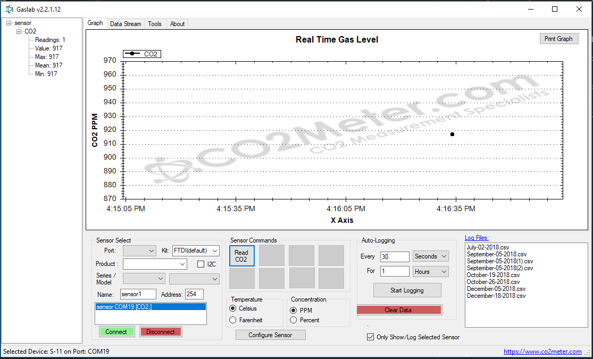


## Section 3: Connecting to Arduino

  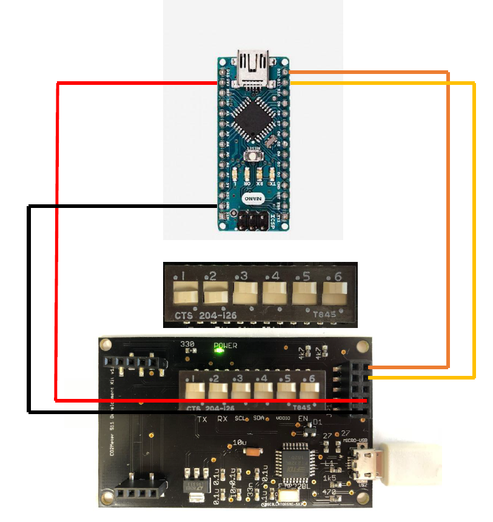
> Wiring Diagram for UART connections to Arduino

```cpp
#include <SoftwareSerial.h>

#define S11_TX 12
#define S11_RX 11
SoftwareSerial s11 = SoftwareSerial(S11_TX, S11_RX);

void setup() {
  // put your setup code here, to run once:
  s11.begin(9600);
  Serial.begin(115200);
}

void loop() {
  // put your main code here, to run repeatedly:
  byte co2Read[] = { 0xfe, 0x04, 0x00, 0x03, 0x00, 0x01, 0xd5, 0xc5 };
  s11.write(co2Read, 8);

  int millisec = 0;
  while(s11.available() <= 0) {
    delay(1);
    millisec++;
    if (millisec > 1500) break;
  }
  delay(50);

  if (s11.available() <= 0) {
    Serial.println("no data available");
    return;
  }

  int s11ResponseSize = s11.available();
  byte s11Response[s11ResponseSize];
  int count = 0;
  while (count < s11ResponseSize) {
    s11Response[count] = s11.read();
    count++;
  }

  int co2 = (s11Response[3] << 8) | s11Response[4];
  Serial.print("CO2 Concentration: ");
  Serial.print(co2);
  Serial.print("\n");
  delay(2000);
}
```

  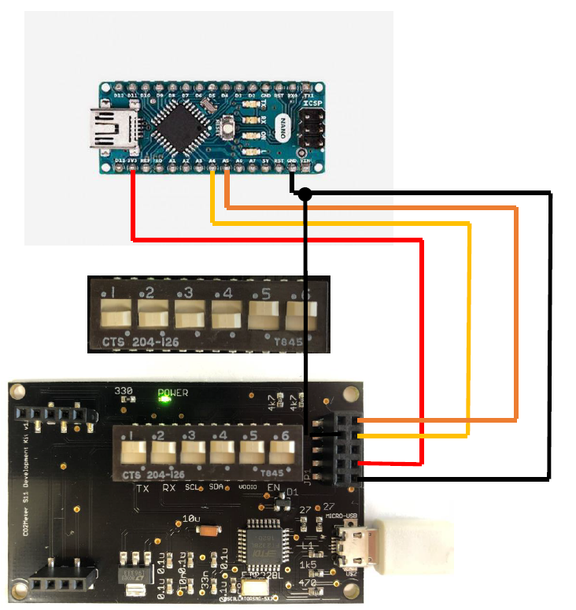
> Wiring Diagram for I2C connections to Arduino

```cpp
#include <Wire.h>

char FIND_ADDRESS = 'F';
char READ_CO2 = 'R';
byte address = 0x68;

void setup() {
  // put your setup code here, to run once:
  Wire.begin();
  Wire.setClock(10000);
  Serial.begin(115200);
  Serial.println("Type F to find all devices on I2C bus and type R to read CO2 from S-11");
}

void sendDataAndReadToAddress(byte reg, byte address, int bufferSize, int readCount) {
  Wire.beginTransmission(address);  
  for (int k = 0; k < bufferSize; k++) {
    Wire.write(reg);    
  }
  Wire.endTransmission(false);  

  delay(20);

  Wire.requestFrom(address, readCount);

  delay(10);
  int nBytes = Wire.available();
  byte buff[nBytes];

  int i = 0;
  while (Wire.peek() != -1) {
    buff[i] = Wire.read();
    Serial.print(buff[i],HEX);
    Serial.print(" ");
    i++;
  }
  //Serial.write(buff, nBytes);
  Serial.print('\n');

  int co2 = (buff[0] << 8) | buff[1];
  Serial.print("CO2 Concentration: ");
  Serial.print(co2);
  Serial.print("\n");
}

void getAllAddress() {
  //Serial.println("Looking for addresses");
  byte error, address;
  for (address = 1; address < 128; address++) {
    Wire.beginTransmission(address);
    error = Wire.endTransmission();
    delay(5);

    if (error == 0) {
      Serial.print(address, HEX);
      Serial.print(" ");
    }
  }
}

void loop() {
  // put your main code here, to run repeatedly:
  while (Serial.available() == 0) { }
  //Delay 10ms to ensure we get the whole message
  delay(10);

  int serialBufferSize = Serial.available();
  byte buff[serialBufferSize];

  int i = 0;
  while (Serial.peek() != -1 && i < serialBufferSize) {
    buff[i] = (byte)Serial.read();
    i++;
  }
  char command = (char)buff[0];
  if (command == FIND_ADDRESS) {
    getAllAddress();
  } else if (command == READ_CO2) {
    //The LSB nibble of the second byte contains the number of data bytes being read
    //Add 2 for the Command byte and Checksum
    int bufferSize = 1;
    int readCount = 2;
    sendDataAndReadToAddress(0x06, address, bufferSize, readCount);
  } else {
    Serial.println("Invalid Command... Type F to find all devices on I2C bus and type R to read CO2 from S-11");
  }
}
```

## Section 4: Connecting to Raspberry Pi

  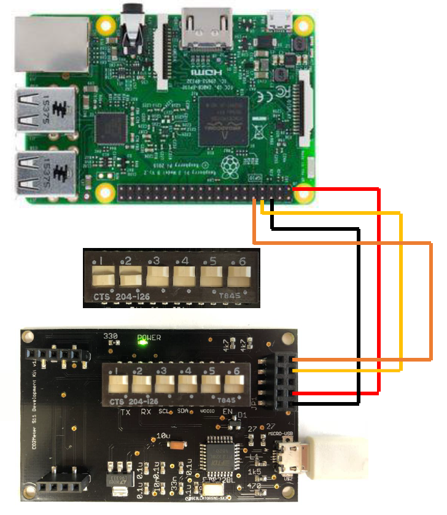
> Wiring Diagram for UART connections to Raspberry Pi

```python
import serial
import time
import fcntl
import binascii

#for usb leave uncommented
ser = serial.Serial("/dev/ttyUSB0", baudrate=9600, timeout=1.5)
#to usb the UART GPIO Pins, comment the above line and uncomment the line below
#ser = serial.Serial("/dev/ttyAMA0", baudrate=9600, timeout=1.5)
ser.flush()
ser.close()
time.sleep(1)

while 1:
  ser.open()
  ser.flush()
  ser.write("\xFE\x04\x00\x03\x00\x01\xD5\xC5")
  time.sleep(1.2)
  timeout=0
  while ser.inWaiting() <= 0:
    time.sleep(0.1)
    timeout = timeout + 1
    if timeout > 10:
      print("timed out with no data")
      break
    resp = ser.read(ser.inWaiting())
    ser.close()
    print("size of response: " + str(len(resp)))
    if len(resp) >= 7:
      binascii.hexlify(bytearray(resp))
      high = ord(resp[3])
      low = ord(resp[4])
      co2 = (high*256) + low
      print(str(co2))
```
