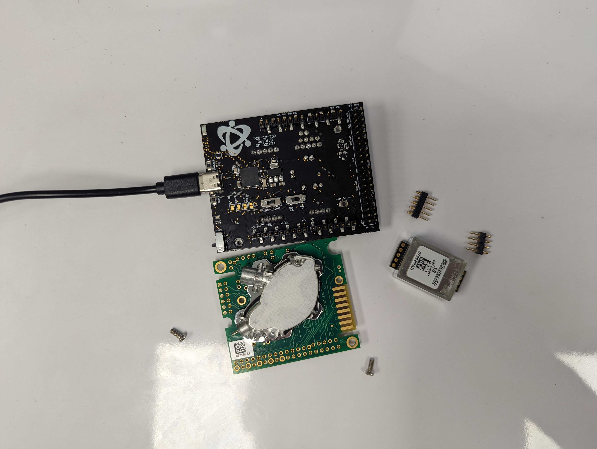
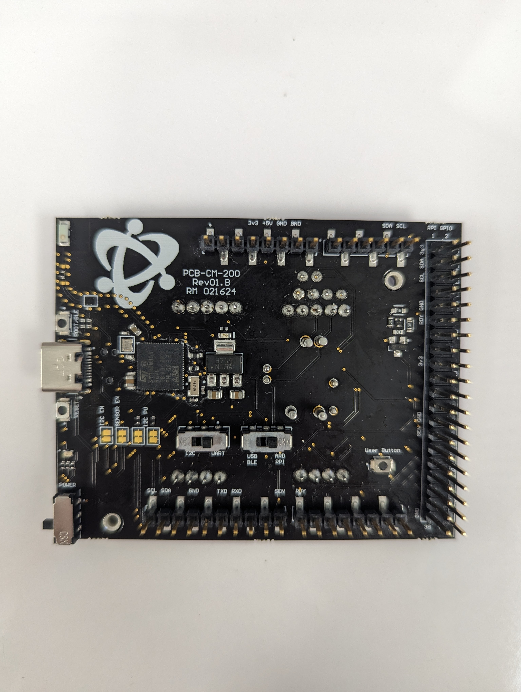

# Senseair K-Series and Miniature Sensors

## Table of Contents
- [CM-200 Sensor Development Kit](#cm-200-sensor-development-kit)

# CM-200 Sensor Development Kit

## Materials Needed
- CM-200 Gas Sensor Development Kit
- Senseair Sensor
- Press-fit male header pins or M2.5 mounting screws
- USB Type-C Cable

For K-Series sensors, use the mounting screws and align with the pogo pins.  For Senseair miniature series sensors, use the Press-Fit male headers.

## CM-200 Setup for GasLab with Senseair Sensors
> Setup Instructions to use Senseair with GasLab or other terminal application through USB

### Switch Settings
Leave the Sensor Configuration Jumpers as default.  Switch the I2C / UART Switch to the right over UART, and the USB - BLE / ARD - RPI switch to the left over USB - BLE.  As pictured below.

### Connect to GasLab
#### 1. Plug in the USB cable
#### 2. Move the Power Switch Up so that it's towards the USB connector, a Red LED should emit
#### 3. Launch GasLab
#### 4. Select COM Port and Sensor
#### 5. Click Connect

## CM-200 Setup for Arduino and Raspberry Pi with UART
> Setup instructions to use GSS Sensors with an Arduino or Raspberry Pi over UART

### Switch Settings
Leave the Sensor Configuartion Jumpers as default.  Switch the I2C / UART Switch to the right over UART, and the USB - BLE / ARD - RPI Switch to the right over ARD - RPI.  As pictured below.

### Arduino Setup
#### 1. If not already installed, download and install [Arduino IDE](https://www.arduino.cc/en/software)
#### 1. Mount the CM-200 onto the Header Pins of an Arduino Uno or Arduino Mega
#### 2. Power Arduino or CM-200 with USB cable
#### 3. Download or Clone Repository
#### 4. Naviagate to Arduino Project to run
#### 5. Double click .ino file
#### 6. Click on the Upload button in Arduino

### Raspberry Pi Setup
#### 1. Mount the CM-200 onto the header pins of a Raspberry Pi Zero, or connect ribbon cable to Raspberry Pi SBC
#### 2. Download or Clone Repository onto Raspberry Pi
#### 3. Navigate to python code to run
#### 4. Run python code

## CM-200 Setup for Arduino with I2C
> Setup instructions to use GSS Sensors with an Arduino over I2C
>
> ### Switch Settings
Add a solder bridge over the I2C EN jumper.  Switch the I2C / UART Switch to the left over I2C, switch the USB - BLE / ARD - RPI switch to the right over ARD - RPI.  As pictured below.

