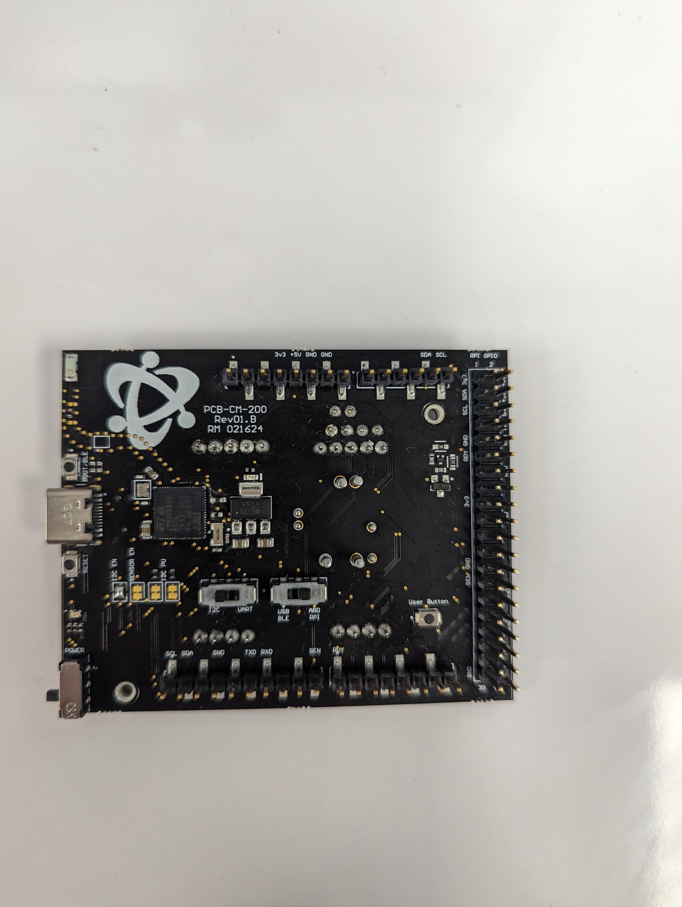
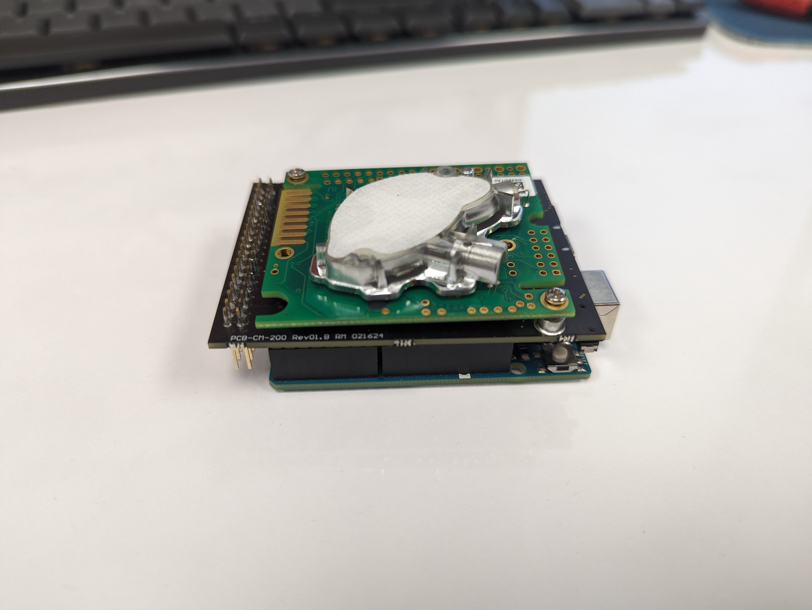
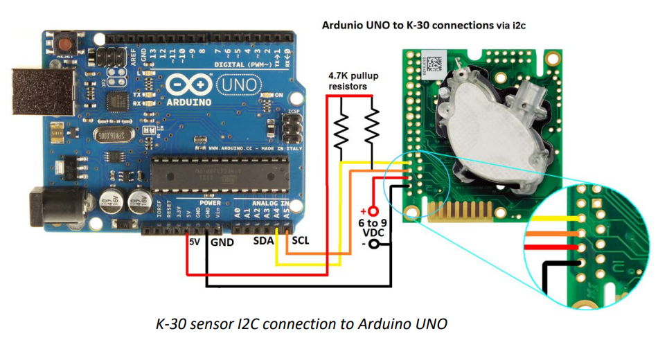
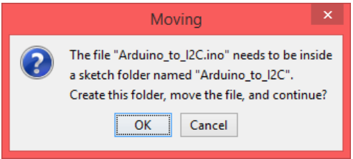
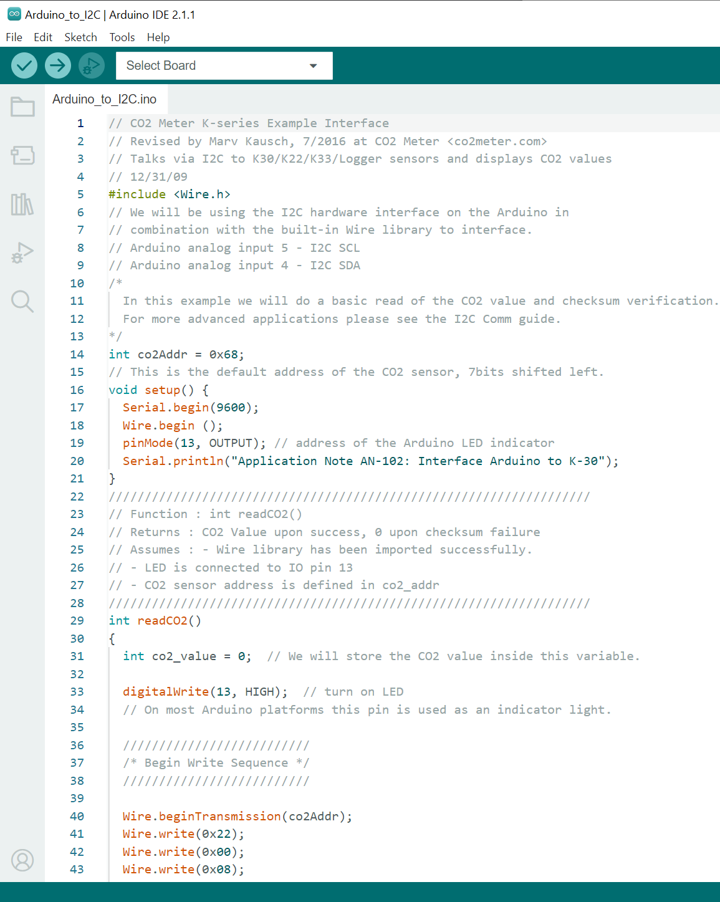

# Senseair Arduino I2C

## CM-200 Setup
### Switch Settings
Leave the Sensor Configuartion Jumpers as default.  Switch the I2C / UART Switch to the right over I2C, and the USB - BLE / ARD - RPI Switch to the right over ARD - RPI.  As pictured below.

### Arduino
To attach the CM-200 to an Arduino Uno or Mega, line up the headers and slide the CM-200 on top of the Arduino.

## Wiring without a CM-200

1. Wire up your device as shown:

## Running Arduino Project

1. Check that your Arduino is connected to a USB port and the on‐board LED indicates power is on.

2. Download or clone this git repo.  You can find instructions on the [ExampleCode main README](https://github.com/co2meter-org/ExampleCode).

3. Save the file where you will remember it (if you want to use it later).

4. Double click the file or right click and press 'Open in Arduino IDE' to open the project.

5. You may see a prompt that says: 

If you do, press 'OK.'

6. Select your board in the top left if it was not done for you. If you cannot select your Arduino board, ensure it is plugged into your computer.

7. Press the checkmark in the top right to compile the code.

8. Press the arrow to send it to your device.

9.  To verify it was flashed, use Tools->Serial Monitor and ensure the device is sending you messages
